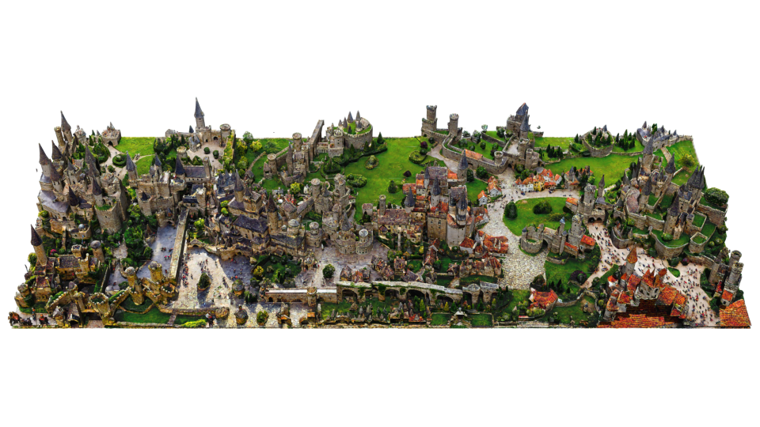

# 🪡Nui(縫い)Scene

## NuiScene: Exploring Efficient Generation of Unbounded Outdoor Scenes

[Han-Hung Lee](https://hanhung.github.io/), [Qinghong Han](https://sulley.cc/), [Angel X. Chang](https://angelxuanchang.github.io/)

**[Project Page](https://3dlg-hcvc.github.io/NuiScene/)**

## Citation

## Acknowledgements

This work was funded by a CIFAR AI Chair, an NSERC Discovery grant, and a CFI/BCKDF JELF grant. We thank Jiayi Liu, and Xingguang Yan for helpful suggestions on improving the paper.
